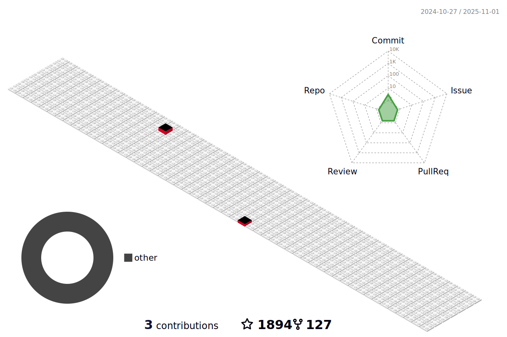

# 𝗛𝗲𝗹𝗹𝗼 𝗜'𝗺 erdengk 👋

@Google Summer of Code (GSoC) 2022 Student , Apache org Rank 11/121, [project](https://summerofcode.withgoogle.com/programs/2022/projects/wWJCM4HI).

@CCF GitLink Code Camp (GLCC) 2022 Mentor

Currently contributing to [Apache ShenYu](https://github.com/apache/shenyu)
<!-- 
Welcome to this [community](https://bbs.gsoc.com.cn/) for beginners of open source. -->
<!-- 

Welcome to subscribe to my newsletter： [Fowever Free](https://erdengk.zhubai.love/). -->

Here is my summary of [open source activities](https://erdengk.github.io/gsoc-analyse/cn/activity/).

## 近况

~~准备22年9月以后去找日常实习~~

~~22年12月更新：已拿到美团、百度、网易、滴滴、B站的日常实习offer~~

准备23年暑期实习及秋季招聘

这是我维护的[《参与开源》](https://erdengk.github.io/gsoc-analyse/)小册。

近期准备更新的分享 : [GSoC 从开始到中选](http://erdengk.top/archives/gsoc-cong-kai-shi-dao-zhong-xuan)(2022年12月左右开始)

## GSoC-CN 社群公开分享

<a href="https://www.bilibili.com/video/BV1E3411P7d2" target="_blank">GSoC-CN 社群关于OSPP的开源经验分享</a>

<a href="https://www.bilibili.com/video/BV19f4y1f71G" target="_blank">GSoC-CN 社群分享：开源与学生</a>
 

<!-- ## Technology Stack

 -->

<!-- ## 📫 Reach me
 
 -->

<!-- <a align="right">
&nbsp;
</a> -->
<!-- 
<a align="center" href="">

&nbsp;
  

 -->

 

<!--  -->

<!-- 

_contribution snake generated with [Platane/snk](https://github.com/Platane/snk)_

 -->

